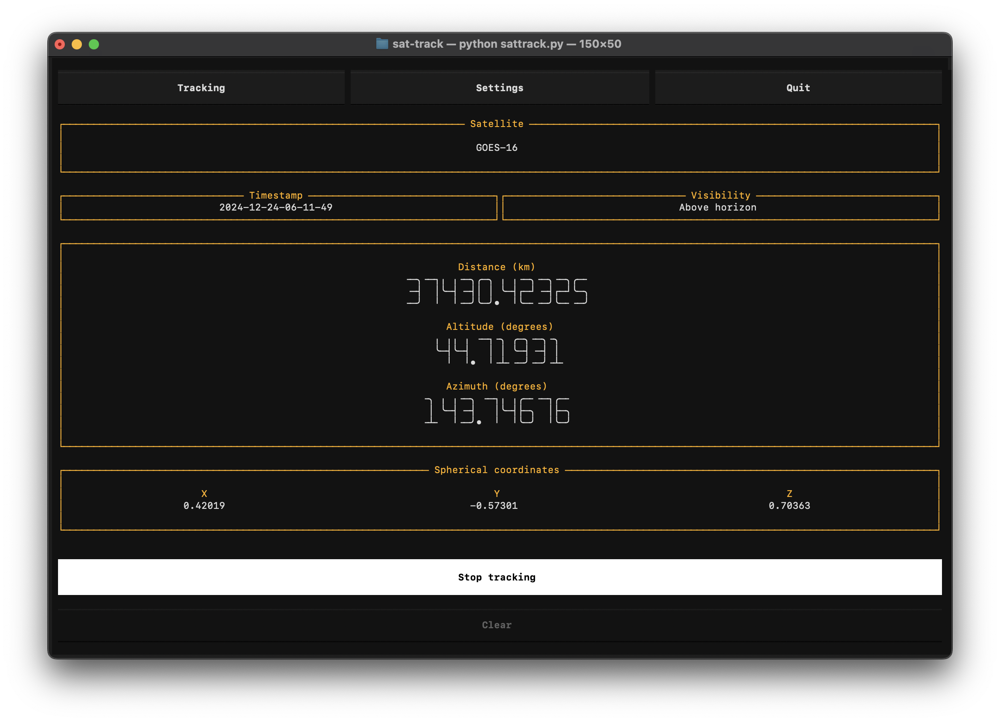

# sat-track
Track satellites using a terminal interface. 

## Setup
Open the directory in a terminal, ceate a new `venv`, and install the packages.

If using Linux, install `python3.12-venv` if not already installed 
```bash
sudo apt install python3.12-venv
```

Make venv
```bash
python3 -m venv satenv
source satenv/bin/activate
```

Install requirements
```bash
pip install -r requirements.txt
```

Run the program 
```bash
python sattrack.py 
```

<br />

**User Interface**

