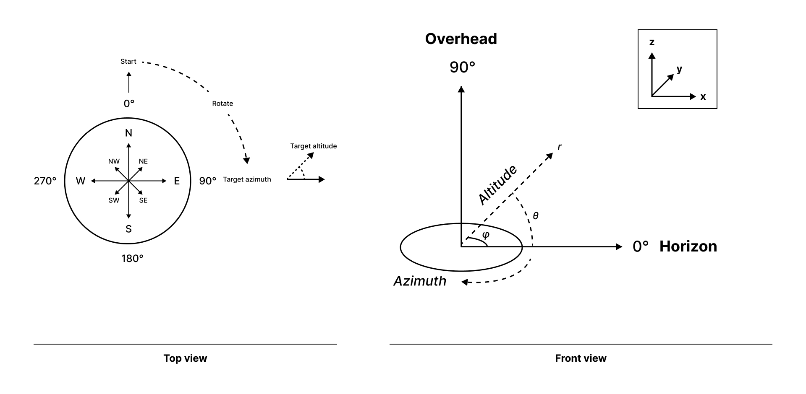
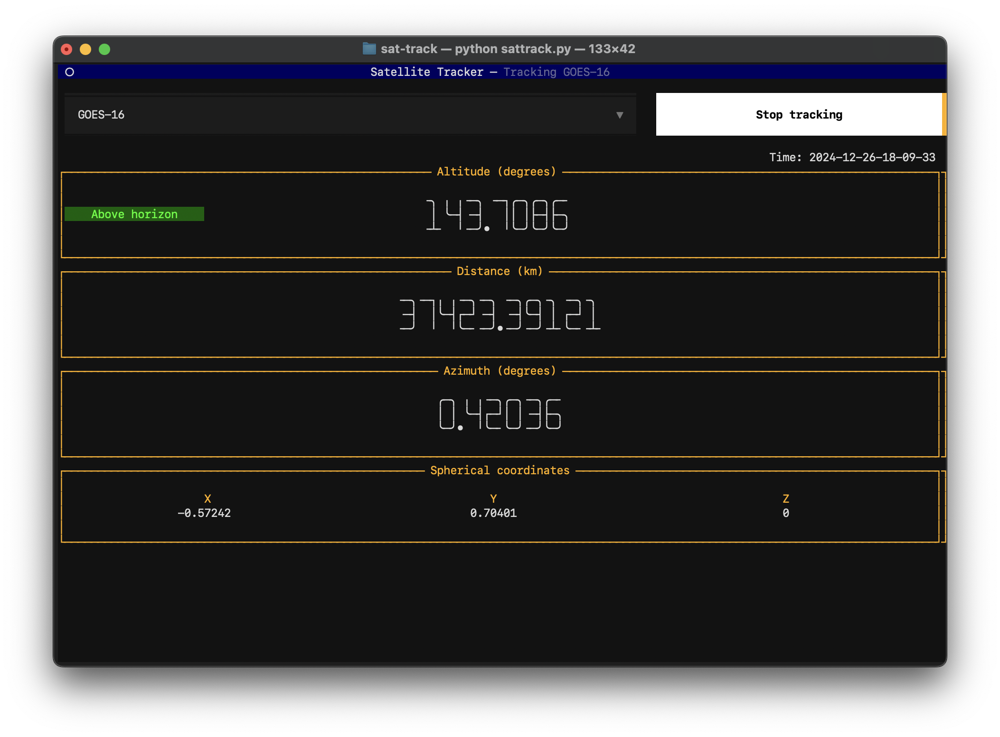

# sat-track
A Text User Interface (TUI) for tracking satellites in a terminal window. Save your latitude and longitude in a `.env` file and run `python sattrack.py` to see the satellite's approximate position relative to your location. Cartesian coordinates are also generated for use in rotating a radio telescope. 


## Setup
Open the directory in a terminal, ceate a new `venv`, and install the packages.

If using Linux, install `python3.12-venv` if not already installed 
```bash
sudo apt install python3.12-venv
```

Make venv (Linux)
```bash
sudo python3 -m venv satenv --system-site-packages
source satenv/bin/activate
```

Make venv (Mac, etc.)
```bash
python3 -m venv satenv
source satenv/bin/activate
```

Install requirements
```bash
pip install -r requirements.txt
```

Run the program 
```bash
python sattrack.py 
```

<br />

Make a `.env` file in the root directory

```
touch .env
```

Open the `.env` file and add your latitude and longitude as environmental variables. Save and close the file. 

Example: 
```
LOCATION_LATITUDE=54.321
LOCATION_LONGITUDE=-76.543
```

## Telescope rotation math



**Note:**
- Be sure to update the TLEs in `satellites.csv` every few months

**User Interface**

